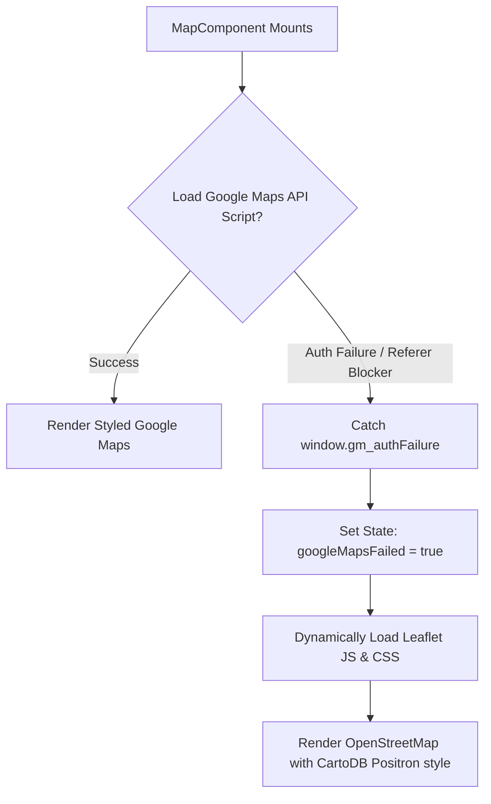

# NestRGU Architecture Handbook

This document provides a comprehensive technical breakdown of the **NestRGU** platform. It outlines the codebase structure, state pipelines, authentication mechanisms, database models, and dual-mapping services to enable rapid onboarding for incoming engineers.

---

## 1. Directory Tree & Architecture Overview

NestRGU is a **Next.js 16.2** application built using **Turbopack**, utilizing React Server Components (RSC), App Router, and Server Actions. Data persistence and authentication are powered by **Supabase**.

```
src/
├── app/                  # App Router entrypoints & page templates
│   ├── about/            # Static details & brand objectives
│   ├── admin/            # Verification queue & moderation actions
│   ├── dashboard/        # Landlord listing logs & click statistics
│   ├── listings/         # Dynamic paths for room inspection, edits, & posting
│   ├── login/            # Supabase Auth interface
│   ├── map/              # Full-viewport mapping interface
│   ├── pricing/          # Premium index tiers & marketing grid
│   ├── globals.css       # Premium Light Theme tokens (nestrgu design)
│   ├── layout.tsx        # Shell rendering, font configurations, toast container
│   └── page.tsx          # Home route triggering Server Action fetches
│
├── components/           # Reusable client & server UI components
│   ├── Footer.tsx        # Standardized light footer
│   ├── HomeContainer.tsx # Staggered hero reveal, statistics, & core browse view
│   ├── ListingCard.tsx   # Premium card display for accommodation items
│   ├── MapComponent.tsx  # Dual-Map Core Wrapper (Google Maps / Leaflet)
│   ├── Navbar.tsx        # Session-aware client header
│   └── SignOutButton.tsx # Action trigger for session termination
│
├── lib/                  # Services, helpers, & config modules
│   ├── services/
│   │   ├── auth.ts       # Sign-in, sign-up, session retrieval triggers
│   │   ├── listings.ts   # Database select, insert, update, & delete queries
│   │   └── moderation.ts # Report logging, verification approvals
│   ├── supabase/
│   │   ├── client.ts     # Client-side Supabase client singleton
│   │   ├── middleware.ts # Edge route guard checking session states
│   │   └── server.ts     # Server action & RSC cookie-aware client factory
│   └── utils/
│       └── distance.ts   # Haversine distance calculator relative to RGU
```

---

## 2. Technical Stack Details

- **Next.js 16.2.10 (Turbopack)**: Revalidates paths server-side dynamically via `revalidatePath` and forces page data compilation in real-time.
- **Tailwind CSS**: Styled inside a high-contrast premium light mode theme. Uses ultra-thin borders (`rgba(0,0,0,0.03)` to `rgba(0,0,0,0.08)`) and high-density typography (Inter/Geist-inspired layouts).
- **Framer Motion**: Manages smooth entrance transitions, staggered word slide-ups on headers, and collapse modules.
- **Supabase**: Serves as the Backend-as-a-Service (BaaS) providing both **PostgreSQL** storage and **Supabase Auth** session cookies.

---

## 3. Database Schema Definitions (Supabase)

### Table: `listings`
Stores details about student accommodations.
| Column | Type | Constraints | Description |
| :--- | :--- | :--- | :--- |
| `id` | `uuid` | Primary Key (Default: `gen_random_uuid()`) | Unique identifier |
| `created_at` | `timestamp` | Default: `now()` | Timestamp of listing creation |
| `owner_id` | `uuid` | Foreign Key -> `auth.users.id` | Landlord identifier |
| `title` | `text` | Not Null (Min length: 3) | Property title |
| `description` | `text` | Not Null (Min length: 10) | Detailed room information |
| `price` | `numeric` | Not Null (Positive values) | Monthly rent in ₹ INR |
| `address` | `text` | Not Null (Min length: 5) | Physical location description |
| `latitude` | `double precision` | Not Null | GIS Latitude |
| `longitude` | `double precision` | Not Null | GIS Longitude |
| `distance_to_rgu` | `double precision`| Calculated in Action | Distance in km from RGU campus coordinates |
| `room_type` | `text` | Check Constraint (in list) | Choice of: `'single'`, `'shared'`, `'apartment'`, `'other'` |
| `amenities` | `text[]` | Default: `Array[]` | List of features (e.g., wifi, parking) |
| `status` | `text` | Default: `'available'` | Availability: `'available'`, `'rented'`, `'unavailable'` |
| `contact_phone` | `text` | Not Null (Min length: 8) | Contact phone number |
| `verified_status`| `text` | Default: `'pending'` | Admin state: `'pending'`, `'inspected'` |
| `reports_count` | `integer` | Default: `0` | Sum of flags filed against property |

---

## 4. Core Workflows & Code Implementation

### A. Authentication & Middleware Pipeline
1. **User Sign Up / Sign In**: Initiated in [login/page.tsx](file:///Users/debashish/Desktop/AGENTS/src/app/login/page.tsx), calling the Server Actions inside [auth.ts](file:///Users/debashish/Desktop/AGENTS/src/lib/services/auth.ts):
   ```typescript
   export async function signIn(prevState: AuthState, formData: FormData) { ... }
   ```
2. **Cookie Creation**: Supabase server-side clients set authentication cookies directly in the request headers using Next.js `cookies` API.
3. **Session Guard**: The Next.js Edge Middleware ([middleware.ts](file:///Users/debashish/Desktop/AGENTS/src/middleware.ts)) calls:
   ```typescript
   export async function updateSession(request: NextRequest) { ... }
   ```
   This intercepts requests to `/dashboard` and `/admin`, checking for active sessions. If missing or invalid, it redirects the user to `/login`.

---

### B. Dual-Mapping Service (Google Maps / Leaflet Fallback)
A major component of the platform is the custom map engine in [MapComponent.tsx](file:///Users/debashish/Desktop/AGENTS/src/components/MapComponent.tsx). It uses a hybrid loader that adapts based on API key authorization status:



#### Code Implementation:
- **Silver Styling**: Google Maps uses a highly muted custom styling array to fit the premium light theme visual guidelines.
- **Interactivity**: Landlords can pick coordinates dynamically during room creation. The marker fires dragging events (`dragend`) or clicks on the map to capture coordinates, updating the React state via the `onCoordinateChange(lat, lng)` callback.

---

### C. Distance Calculation (Haversine Formula)
Distance relative to Rajiv Gandhi University's main gate is calculated server-side inside [distance.ts](file:///Users/debashish/Desktop/AGENTS/src/lib/utils/distance.ts) whenever a listing is created or edited:

$$\text{RGU coordinates} = (27.150146, 93.761664)$$

$$\Delta\text{lat} = \text{lat}_2 - \text{lat}_1, \quad \Delta\text{lon} = \text{lon}_2 - \text{lon}_1$$

$$a = \sin^2\left(\frac{\Delta\text{lat}}{2}\right) + \cos(\text{lat}_1) \cdot \cos(\text{lat}_2) \cdot \sin^2\left(\frac{\Delta\text{lon}}{2}\right)$$

$$c = 2 \cdot \text{atan2}\left(\sqrt{a}, \sqrt{1-a}\right), \quad d = R \cdot c \quad (\text{where } R = 6371\text{ km})$$

---

### D. Server Action & Form Handling
Posting accommodations uses React's `useActionState` (state-less actions).
1. **Forms**: The [ListingForm.tsx](file:///Users/debashish/Desktop/AGENTS/src/components/ListingForm.tsx) component binds properties dynamically:
   ```typescript
   const [state, formAction, isPending] = useActionState(action, null)
   ```
2. **Submissions**: On submission, it sends data via `FormData` to `createListing` inside [listings.ts](file:///Users/debashish/Desktop/AGENTS/src/lib/services/listings.ts).
3. **Cache Invalidation**: On success, `revalidatePath('/')` is triggered to clear Next.js static cache and display the new listing on the home screen immediately.
